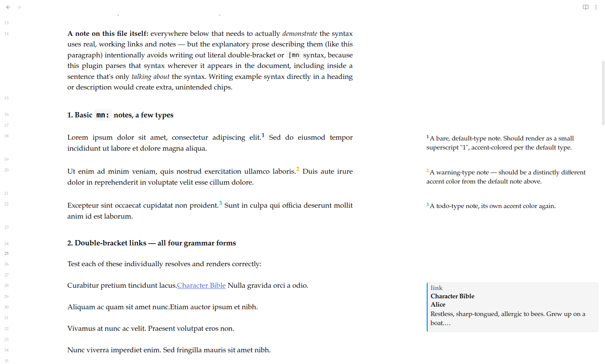

# Margin Notes

Literal book-margin notes for Obsidian — jot a quick note next to any
paragraph, the same way you'd scribble in the margin of a physical book.
Turn it on per file, per folder, or vault-wide. Comes with an optional AI
notes agent that can suggest and place notes for you.

## Getting started

1. Settings → Community plugins → enable "Margin Notes".
2. Turn margin notes on for a file: add `margin-notes: true` to that
   file's frontmatter (or set a folder rule / "every file" in the plugin's
   settings, if you'd rather not add it per file).
3. Run **Insert margin note** (Cmd/Ctrl+P) with your cursor in a
   paragraph, or type `[mn.` to pick a note type as you write.
4. That's it — the note shows as a small superscript marker inline, with
   its full content in a chip in the margin.

### Writing a note directly

You can also just type the syntax yourself instead of using the command:

| You type | What you get |
|---|---|
| `[mn: a quick note]` | a plain margin note |
| `[mn.question: why does this happen?]` | a note tagged with a type (color-coded in the margin) |

### Links

A normal `[[wikilink]]` in a file with margin notes turned on renders as
plain, clickable text — same syntax you already know. Clicking it opens
the target note in a new tab, so you never lose your place in the
document you're reading or annotating.

## The AI notes agent (optional)

Beyond writing notes yourself, you can ask an AI agent to read a file (or
your whole vault) and suggest notes for you — continuity issues, line
edits, or whatever a custom agent profile asks it to look for. It's
entirely opt-in: nothing runs until you explicitly trigger it.

Set it up in Settings → Margin Notes:
- Pick a provider (Claude, OpenAI, Gemini, or a local Ollama instance) and
  add your API key, or point at Ollama for a fully local setup.
- Pick an agent profile — two are bundled (continuity checker, line
  editor), or drop your own markdown file into the configured agents
  folder to define more.
- Pick a scope: current selection, current file, or the whole vault.
- Run it from the command palette or the settings-tab button.

Every AI-suggested note is clearly marked (`[mn.ai: ...]`) and never edits
your existing prose — it only adds notes alongside it.

### Network use

The core margin-notes feature (writing `[mn: ...]` and `[[link]]` markers
yourself) makes no network calls at all. The AI agent above is the only
feature that does:

- **What's sent:** the text of the current file, the current selection, or
  every enabled file in the vault — whichever scope you pick — plus your
  chosen agent profile's instructions. Nothing else (no telemetry, no
  usage analytics, no vault metadata beyond that text).
- **Where it's sent:** whichever provider you configure and give an API
  key to — Anthropic (Claude), OpenAI, or Google (Gemini) — or a locally
  running Ollama instance you point at yourself, in which case nothing
  leaves your machine. You choose the provider; nothing is contacted by
  default.
- **When it's sent:** only when you explicitly run the agent — never
  automatically, never on a timer, never on file open/save.
- **API keys:** stored through Obsidian's own built-in secret storage
  (`app.secretStorage`, added in Obsidian **1.11.4**) when your Obsidian
  is that version or newer — encrypted at rest via your OS's own secret
  store (macOS Keychain / Windows Credential Manager / Linux secret
  service under the hood), vault-scoped, and never written into
  `data.json` or any other plugin file at all. The settings tab tells
  you plainly which case applies; it never claims stronger protection
  than what's actually happening.
  - **On Obsidian 1.11.4 or later:** keys live entirely in Obsidian's
    native secret storage. There's no separate key file to gitignore and
    nothing plugin-specific for a sync tool to carry — Obsidian owns
    where and how this is persisted. If you're curious where that
    actually lives on disk, or want to know its own sync/backup
    behavior, see Obsidian's own documentation for the Secret Storage
    feature; this plugin has no control over that beyond calling the API.
  - **On Obsidian older than 1.11.4:** the native API doesn't exist yet
    on your version, so keys fall back to being stored in plain text in
    this plugin's normal `data.json`
    (`.obsidian/plugins/margin-notes/data.json`) — the settings tab
    shows a warning to this effect next to the key field. Upgrading
    Obsidian moves the key into encrypted storage automatically the next
    time you re-save that field; nothing else about the plugin's
    behavior changes.
    - **If your vault is a git repository** and you're on this older
      path: keep in mind `data.json` (which now holds every plugin
      setting, keys included, rather than keys living in a separately
      gitignorable file) would need to be excluded from version control
      to avoid committing a plaintext key — or simply upgrade Obsidian,
      which removes the issue entirely.
    - **If you sync this vault** (Obsidian Sync, Dropbox, Syncthing,
      iCloud, etc.) while on this older path, the plaintext key travels
      with `data.json` wherever that sync goes.

## Installing (no build needed)

1. Create `<your-vault>/.obsidian/plugins/margin-notes/` (`.obsidian` is
   the default name for a vault's config folder — if yours was renamed,
   use that folder instead).
2. Copy `manifest.json`, `main.js`, and `styles.css` into that folder.
3. In Obsidian: Settings → Community plugins → reload, then enable "Margin Notes".

## Known caveats

- **Selection scope needs a live editor** — running the AI agent on just
  your current selection only works on the file you currently have open,
  not when scope is set to "vault."

## More

- Building from source, how the plugin is put together internally, and
  ideas being considered for the future all live in
  [`docs/DEVELOPMENT.md`](docs/DEVELOPMENT.md) — useful if you're
  modifying the plugin or just curious, not needed to use it.